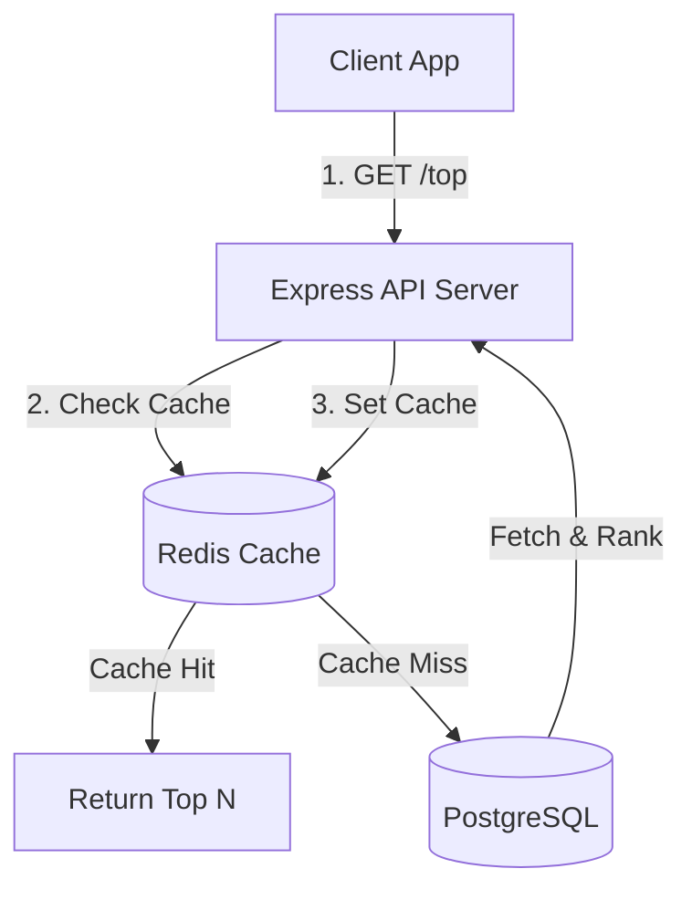
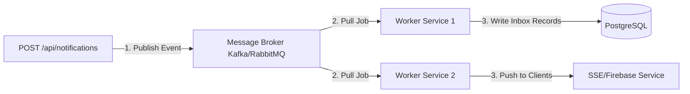

# Stage 4: Performance & System Scaling

This document details bottleneck identification, caching mechanisms, event-driven architectures, and communication paradigms to scale the Notification System.

---

## 1. Performance Bottlenecks

In a standard monolithic architecture, the system hits performance ceilings at several key points:

1.  **Database Connection Saturation:** When millions of users simultaneously open or refresh their client apps, the database receives massive spikes of concurrent reads, exhausting the connection pool.
2.  **API Network Latency:** Fetching data synchronously from external downstream APIs (e.g., vehicle list or notification provider) blocking Express threads.
3.  **Heavy Write Amplification:** If the inbox dispatcher inserts separate records for every user in a large audience (e.g., 100,000 students receiving a placement notice), the database disk write throughput collapses.

---

## 2. Caching Strategy (Redis)

To protect the database and achieve sub-millisecond response times, Redis is introduced as a distributed caching layer.

### A. Caching Pattern: Cache-Aside
*   **Reads:** Query Redis first. On cache miss, fetch from PostgreSQL, write to Redis with a Time-To-Live (TTL), and return.
*   **Writes (Invalidation):** When a new notification is created or a user marks an item as read, invalidate (delete) the user's specific cache key.

### B. Redis Data Structures
*   **Structure:** Sorted Sets (`ZSET`)
*   **Key:** `user:inbox:<user_id>`
*   **Score:** `priority_score`
*   **Value:** `notification_id`
*   **Eviction Policy:** `allkeys-lru` (Least Recently Used) to automatically discard older unreferenced cached inboxes when memory is full.

---

## 3. Event-Driven Architecture (Decoupling)

To handle massive bulk notification dispatch without blocking the main server threads, a Message Broker is introduced like **Apache Kafka** or **RabbitMQ**.

*   **Kafka:** Highly recommended for massive, partitionable streams where ordered event processing and playback capabilities are required.
*   **RabbitMQ:** Recommended for complex routing patterns, exchange-binding configurations, and simple task queues.

---

## 4. Communication Paradigms: Polling vs. Push

Selecting the right communication protocol ensures high performance and low battery/resource drain on clients.

| Paradigm | Server Resource | Client Overhead | Latency | Use Case |
|---|---|---|---|---|
| **Short Polling** | Extremely High (Frequent connections) | High | High (Depends on interval) | Simple dashboards where real-time is not critical. |
| **Long Polling** | High (Connections kept open) | Medium | Medium-Low | Legacy systems where WebSockets are blocked by proxies. |
| **Server-Sent Events (SSE)** | Low (Multiplexed over HTTP/2) | Very Low | **Very Low (Instant)** | **Prioritized Inboxes, Real-time news feeds.** |
| **WebSockets** | Medium-High (Dedicated stateful TCP socket) | Low | **Instant** | Interactive chat apps, multiplayer gaming. |
