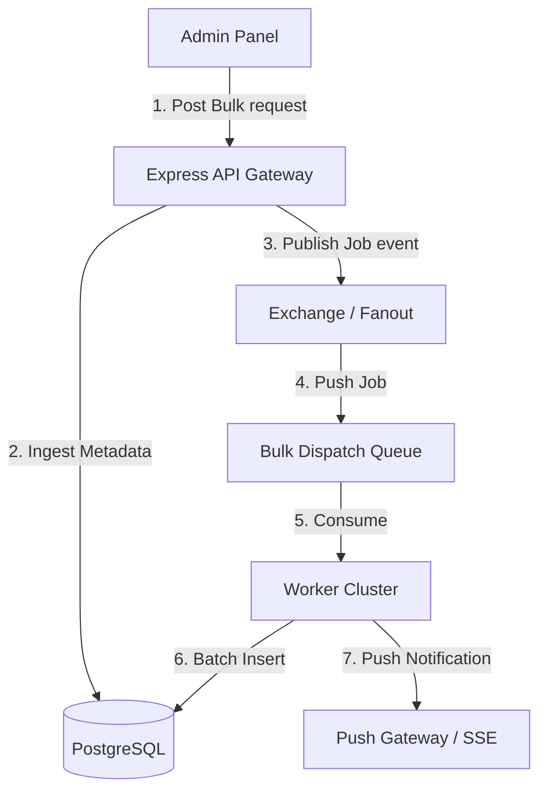

# Stage 5: Bulk Notifications & Reliability

This document outlines the architecture and design patterns required to dispatch bulk notifications to millions of users reliably and with high throughput.

---

## 1. Bulk Notification Dispatch Architecture

To broadcast a single message (e.g., "Placement Drive Registration Open") to 100,000+ users, sending individual synchronous database inserts will block the application. A **fan-out write pipeline** is used.



### Dispatch Workflow:
1.  **Metadata Ingestion:** Save the notification message and type in the `notifications` metadata table once.
2.  **Job Enqueueing:** Publish a dispatch request `(notification_id, target_audience_query)` to a message queue.
3.  **Worker Fan-Out:** Stateless workers consume the job, fetch user IDs matching the audience query in chunks (e.g., 5,000 at a time), and perform **Batch Inserts** into the `user_notifications` table.

---

## 2. Horizontal Scalability & Statelessness

To scale the API tier to handle millions of connections:
*   **Stateless Services:** Express servers store no session or application state in local RAM. All state resides in Redis (caching/sessions) or PostgreSQL (persistence).
*   **Load Balancing:** Use an Application Load Balancer (ALB) or Nginx with Round-Robin or Least-Connections routing to distribute traffic across a cluster of stateless Express instances.
*   **Sticky Sessions (Optional):** If WebSockets are used, the load balancer must support sticky sessions, but SSE does not require it.

---

## 3. Reliability & Idempotency

Network glitches or database timeouts can cause delivery retries, leading to duplicate notifications. Idempotency keys are implemented.

*   **Idempotency Key Generation:** Combine `user_id` and `notification_id` or a client-generated UUID.
*   **Database Level Constraint:** Add a unique index to the `user_notifications` mapping:
    ```sql
    CREATE UNIQUE INDEX uq_user_notification_id 
    ON user_notifications(user_id, notification_id);
    ```
*   **Upsert Handling:** If a duplicate insert is attempted, use `ON CONFLICT DO NOTHING` to prevent duplicate writes and raise no error.

---

## 4. Retry Strategy & Failure Handling

When external push gateways (e.g., Firebase, Apple Push Notification Service) fail or throttle requests, resilience patterns are implemented:

### A. Exponential Backoff with Jitter
Failed notification pushes are retried with increasing delay intervals to avoid overloading the external service:
$$\text{Delay} = 2^{\text{attempt}} \times 1000\text{ms} + \text{Random Jitter}$$

### B. Dead Letter Queue (DLQ)
If a message fails to deliver after a maximum number of retries (e.g., 5 times):
1.  It is moved from the main processing queue to the **Dead Letter Queue**.
2.  Workers log the failure and fire an alert.
3.  Support teams can analyze the DLQ to identify invalid device tokens or downstream outages without blocking the primary pipeline.

### C. Circuit Breaker Pattern
If downstream push networks fail consistently (e.g., 50% failure rate over 10 seconds), the **Circuit Breaker** trips (opens). The system immediately fails calls locally and falls back to saving notifications to the DB only, sparing the app from waiting on timeouts.
